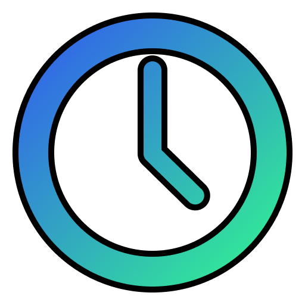

<h1 align="center">
  
  <br />
  <tt>CronK8s</tt>
</h1>


This is a [Next.js](https://nextjs.org/) project bootstrapped with [`create-next-app`](https://github.com/vercel/next.js/tree/canary/packages/create-next-app).

## Getting Started

### Setting up pocketbase

First, you need pocketbase set up:

```bash
./init
```

This will install the latest version of [pocketbase](https://pocketbase.io).

Next you will need to update pocketbase's database schema. You can do this using the built-in `migrate` feature:

```bash
./pocketbase migrate
```

Once pocketbase is ready you can start it with:

```bash
./pocketbase serve
```

### Setting up your environment

Once pocketbase is running you can visit http://localhost:8090/_/ to visit the pocketbase admin UI. When you first load the UI you will be presented with a screen to create your admin account, go ahead and do this. You can either create another admin user from the pocketbase admin UI, or use the credentials you just signed up with:

```bash
cp .env .env.local
```

Now update the variables in `.env.local`

```bash
POCKETBASE_ADMIN_USER={admin_email_address}
POCKETBASE_ADMIN_PASSWORD={admin_password}
```

## Development

In a separate terminal you can start NextJS
First, run the development server:

```bash
yarn dev
```

Open [http://localhost:3000](http://localhost:3000) with your browser to see the result.

You can start editing the page by modifying `pages/index.tsx`. The page auto-updates as you edit the file.

[API routes](https://nextjs.org/docs/api-routes/introduction) can be accessed on [http://localhost:3000/api/hello](http://localhost:3000/api/hello). This endpoint can be edited in `pages/api/hello.ts`.

The `pages/api` directory is mapped to `/api/*`. Files in this directory are treated as [API routes](https://nextjs.org/docs/api-routes/introduction) instead of React pages.

## Learn More

To learn more about Next.js, take a look at the following resources:

- [Next.js Documentation](https://nextjs.org/docs) - learn about Next.js features and API.
- [Learn Next.js](https://nextjs.org/learn) - an interactive Next.js tutorial.

You can check out [the Next.js GitHub repository](https://github.com/vercel/next.js/) - your feedback and contributions are welcome!

## Deploy on Vercel

The easiest way to deploy your Next.js app is to use the [Vercel Platform](https://vercel.com/new?utm_medium=default-template&filter=next.js&utm_source=create-next-app&utm_campaign=create-next-app-readme) from the creators of Next.js.

Check out our [Next.js deployment documentation](https://nextjs.org/docs/deployment) for more details.
